# Pydantic Config

A Pydantic-driven CLI with TOML / YAML / JSON config file support.

```python
from pydantic_config import cli, BaseConfig

class Config(BaseConfig):
    lr: float = 1e-4
    batch_size: int = 32

config = cli(Config)
```

## Install

```bash
uv add git+https://github.com/PrimeIntellect-ai/pydantic-config
```

For TOML support:
```bash
uv add "prime-pydantic-config[toml] @ git+https://github.com/PrimeIntellect-ai/pydantic-config"
```

For all formats (TOML + YAML):
```bash
uv add "prime-pydantic-config[all] @ git+https://github.com/PrimeIntellect-ai/pydantic-config"
```

## Features

Every example below uses [`examples/train.py`](examples/train.py), a dummy
training config that exercises the patterns common in `prime-rl`-style
training scripts.

### Help output

`--help` is auto-generated from the model. Each `BaseModel` field becomes its
own panel; discriminated-union variants get a panel each; `Optional[BaseModel]`
fields are annotated `(optional, default: None)`. Descriptions are sourced from
`Field(description=...)` or a PEP 224 attribute docstring below the field.

```bash
uv run python examples/train.py --help
```

<p align="center">
  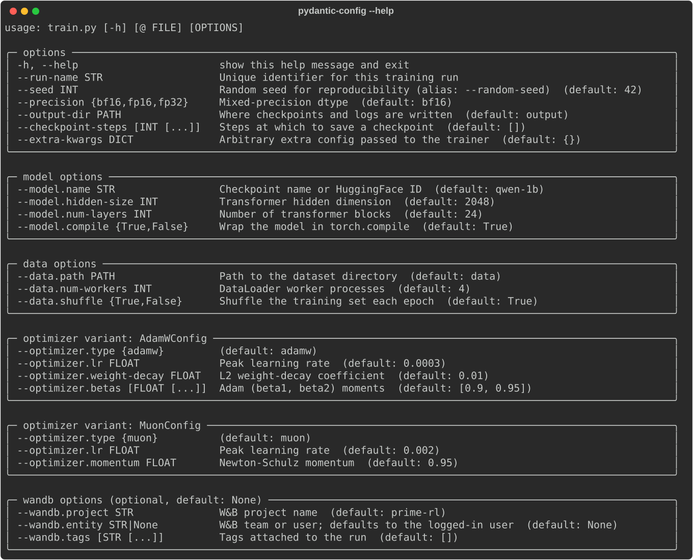
</p>

### Config files via `@`

Load a whole config from a TOML, YAML, or JSON file. CLI args layered on top
always win — same precedence as `default` < file < CLI.

```bash
uv run python examples/train.py @ examples/train.toml
uv run python examples/train.py @ examples/train.yaml
uv run python examples/train.py @ examples/train.toml --seed 0 --no-model.compile
```

<p align="center">
  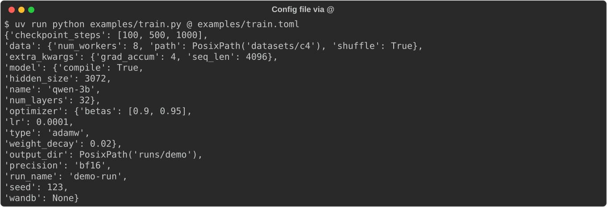
</p>

### Required fields

A field without a default must be passed. The error is rendered as a boxed
message naming the missing CLI flag, not a raw pydantic traceback.

```bash
uv run python examples/train.py   # errors: --run-name is required
```

<p align="center">
  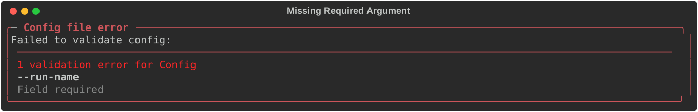
</p>

### Nested config groups

Sub-configs are addressed via dotted paths. Field names are kebab-cased on the
CLI; pydantic still validates against the snake_case attribute.

```bash
uv run python examples/train.py --run-name r1 --model.hidden-size 4096 --data.num-workers 16
```

<p align="center">
  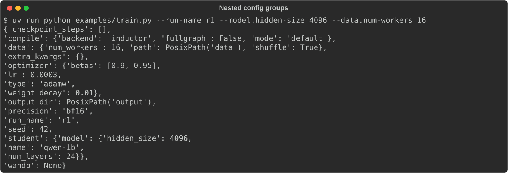
</p>

### Bool flags and `--no-` negation

Bare `--flag` sets a bool to `True`; `--no-flag` sets it to `False`. Works on
nested fields too.

```bash
uv run python examples/train.py --run-name r1 --no-compile.fullgraph --no-data.shuffle
```

<p align="center">
  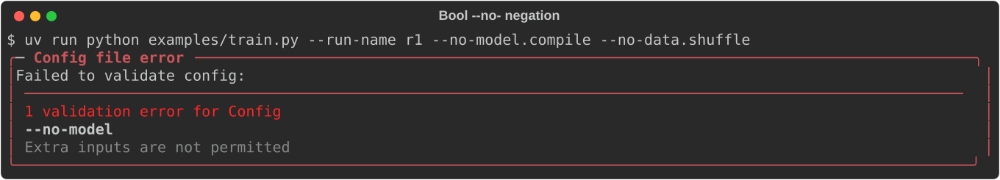
</p>

### Lists

Lists accept either space-separated values or a JSON literal. Negative numbers
(e.g. `-1e-3`) are values, not flags.

```bash
uv run python examples/train.py --run-name r1 --checkpoint-steps 100 200 500
uv run python examples/train.py --run-name r1 --checkpoint-steps '[100, 200, 500]'
```

<p align="center">
  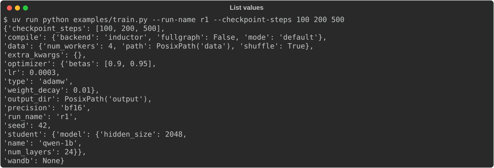
</p>

### Dicts

Dict fields take a JSON literal on the CLI. A TOML/YAML dict and a CLI dict
deep-merge — CLI keys win on conflict but don't wipe the file's keys.

```bash
uv run python examples/train.py --run-name r1 --extra-kwargs '{"seq_len": 4096}'
```

<p align="center">
  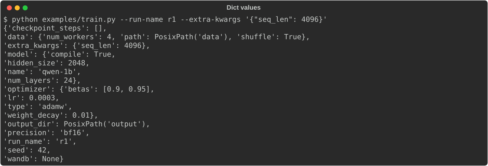
</p>

### Optional sub-configs

A field typed `WandbConfig | None = None` is off by default. The bare flag
turns it on with defaults; a sub-field flag both activates the sub-config and
overrides the field.

```bash
uv run python examples/train.py --run-name r1 --wandb                                 # enable with defaults
uv run python examples/train.py --run-name r1 --wandb.project demo --wandb.entity me  # enable + override
uv run python examples/train.py --run-name r1 --wandb @ examples/wandb.toml           # enable from a file
```

<p align="center">
  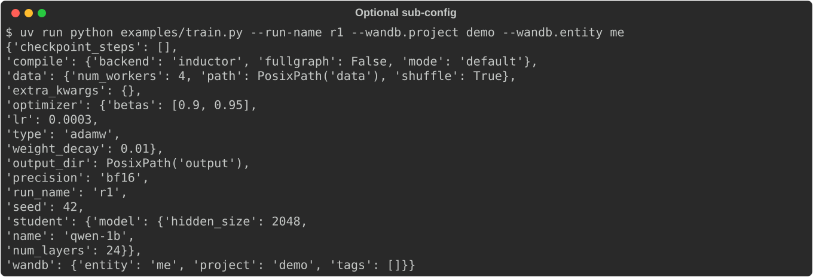
</p>

### Disabling an optional sub-config

A field typed `CompileConfig | None = CompileConfig()` is on by default.
`--no-compile` disables it; `--compile None` does the same. Sub-fields can
still be overridden without disabling: `--compile.mode max-autotune`.
In TOML, write `compile = "None"` to disable.

```bash
uv run python examples/train.py --run-name r1 --no-compile                              # disable
uv run python examples/train.py --run-name r1 --compile.mode max-autotune               # override sub-field
uv run python examples/train.py --run-name r1 --wandb @ examples/wandb.toml --no-wandb  # file enables, CLI disables
```

<p align="center">
  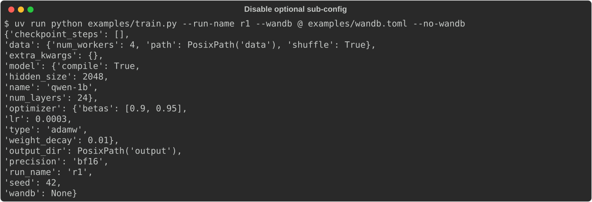
</p>

### Discriminated unions

Multi-variant fields (e.g. `optimizer: AdamWConfig | MuonConfig`) are switched
by the `type` tag. Each variant renders its own help panel. The default
variant's `type` is auto-injected, so partial overrides keep the same variant.

```bash
uv run python examples/train.py --run-name r1 --optimizer.weight-decay 0.05               # stay on default (adamw)
uv run python examples/train.py --run-name r1 --optimizer.type muon --optimizer.lr 2e-3   # switch to muon
uv run python examples/train.py --run-name r1 --optimizer @ examples/optimizer.toml       # load a variant from a file
```

<p align="center">
  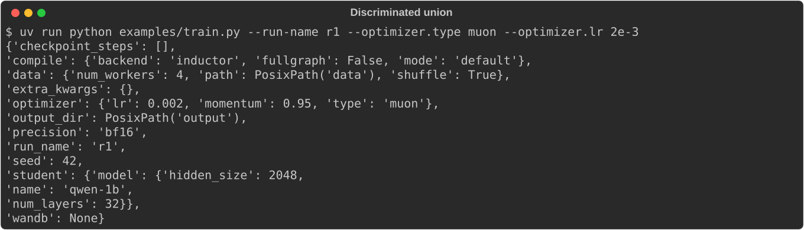
</p>

### Validation aliases

`Field(validation_alias=AliasChoices("seed", "random_seed"))` makes both names
accepted on the CLI and in config files. The library normalizes either form to
the canonical key before validation, so mixing TOML + CLI under different
names is safe (CLI still wins on conflict).

```bash
uv run python examples/train.py --run-name r1 --random-seed 7      # CLI alias
uv run python examples/train.py @ examples/train.toml              # TOML uses random_seed
uv run python examples/train.py @ examples/train.toml --seed 99    # TOML alias + CLI canonical override
```

<p align="center">
  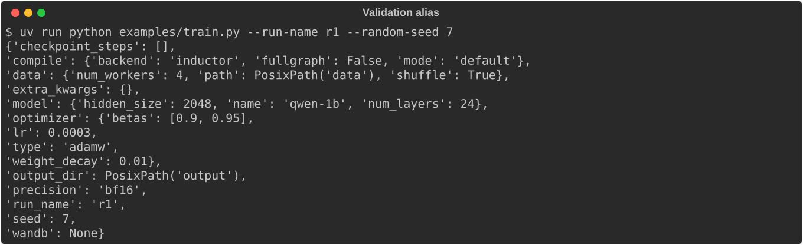
</p>

### Legacy key remapping via before-validators

When a config key is renamed (e.g. `model.*` → `student.model.*`), a
`model_validator(mode="before")` can remap the old key so existing TOML files
and CLI flags keep working. Unknown CLI flags are passed through to the
validator instead of being rejected, so both the old and new paths work
transparently.

```python
class Config(BaseConfig):
    student: StudentConfig = StudentConfig()

    @model_validator(mode="before")
    @classmethod
    def _migrate_model_to_student(cls, data):
        if isinstance(data, dict) and "model" in data and "student" not in data:
            data["student"] = {"model": data.pop("model")}
        return data
```

```bash
uv run python examples/train.py --run-name r1 --model.name qwen-7b            # legacy CLI path
uv run python examples/train.py --run-name r1 --student.model.name qwen-7b    # new CLI path
uv run python examples/train.py @ examples/train.toml                         # TOML uses legacy [model]
```

### Field and model descriptions

Field descriptions shown in `--help` can be set via `Field(description=...)`
or a PEP 224 attribute docstring (a string literal directly after the field).

Sub-config panel titles pick up the class docstring of the inner `BaseModel`,
or the field-level description/docstring if one is set. This lets `--help`
communicate what each config group is for without extra boilerplate.

```python
class DataConfig(BaseConfig):
    """Dataset and dataloader settings."""      # → shows in the panel title

    num_workers: int = 4
    """DataLoader worker processes"""           # → shows next to --data.num-workers
```

### `--flag=value` form

Both `--flag value` and `--flag=value` are accepted.

```bash
uv run python examples/train.py --run-name=r1 --seed=7
```

### `--plain` and `--no-wide`

`--plain` disables ANSI colors; `--no-wide` caps panel width at 80 columns.
Both can also be set via environment variables (`PYDANTIC_CONFIG_PLAIN`,
`PYDANTIC_CONFIG_WIDE`) or as explicit `cli()` keyword arguments (which take
highest precedence).

```bash
uv run python examples/train.py --plain --help               # no colors
uv run python examples/train.py --no-wide --help              # panels capped at 80 columns
PYDANTIC_CONFIG_PLAIN=1 uv run python examples/train.py       # env var
```

### Pydantic validators

Built-in field constraints (`gt`, `ge`, `lt`, `le`) and custom validators
(`@field_validator`, `@model_validator(mode="after")`) work as expected.
Validation errors are rendered with the offending CLI flag.

```python
class AdamWConfig(BaseConfig):
    lr: float = Field(3e-4, gt=0)                     # built-in: must be > 0

class ModelConfig(BaseConfig):
    hidden_size: int = Field(2048, gt=0)
    num_layers: int = Field(32, gt=0)

    @model_validator(mode="after")                     # custom cross-field check
    def _check(self):
        if self.hidden_size % self.num_layers != 0:
            raise ValueError("hidden_size must be divisible by num_layers")
        return self

class Config(BaseConfig):
    checkpoint_steps: list[int] = []

    @field_validator("checkpoint_steps")               # custom field validator
    @classmethod
    def _sorted(cls, v):
        if v != sorted(v):
            raise ValueError(f"must be in ascending order, got {v}")
        return v
```

```bash
uv run python examples/train.py --run-name r1 --optimizer.lr 0                       # gt=0 rejects zero
uv run python examples/train.py --run-name r1 --data.num-workers -1                  # ge=0 rejects negative
uv run python examples/train.py --run-name r1 --model.hidden-size 100 --model.num-layers 7  # after validator
uv run python examples/train.py --run-name r1 --checkpoint-steps 500 100 200         # field validator
```

### Validation errors point at the CLI flag

Pydantic's `ValidationError` is wrapped so the user sees the offending flag
inline, not a raw `pydantic_core` traceback.

```bash
uv run python examples/train.py --run-name r1 --seed nope
```

<p align="center">
  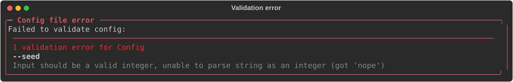
</p>

### Unknown flags get a suggestion

Typos are caught with a `difflib`-powered "did you mean" hint.

```bash
uv run python examples/train.py --run-name r1 --seedz 5   # -> did you mean --seed?
```

<p align="center">
  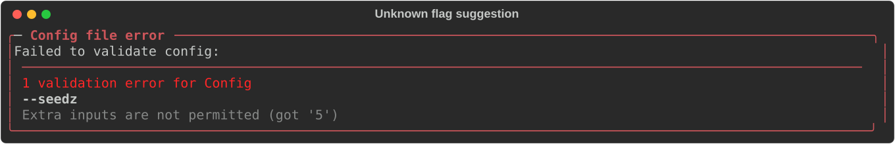
</p>

### Config file not found

```bash
uv run python examples/train.py @ nonexistent.toml
```

<p align="center">
  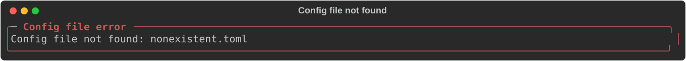
</p>

## Development

```bash
uv sync --extra all
uv run pytest
```
